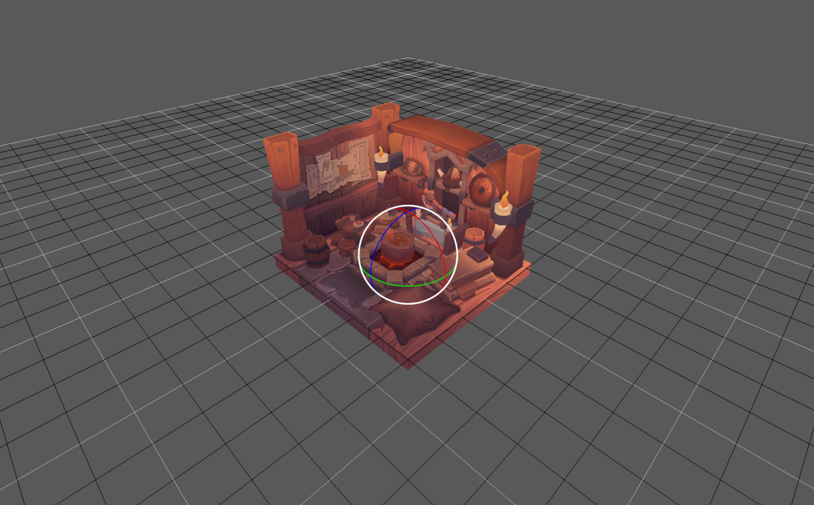
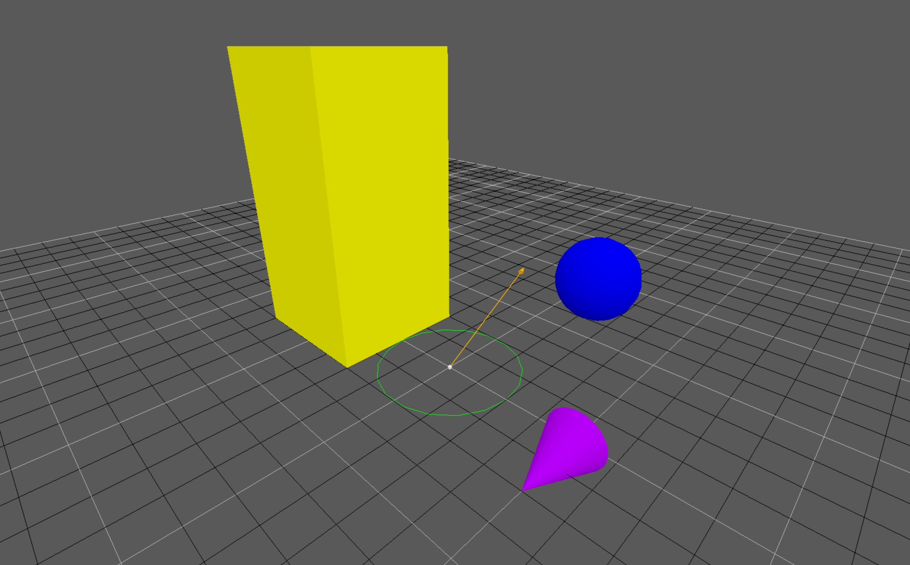
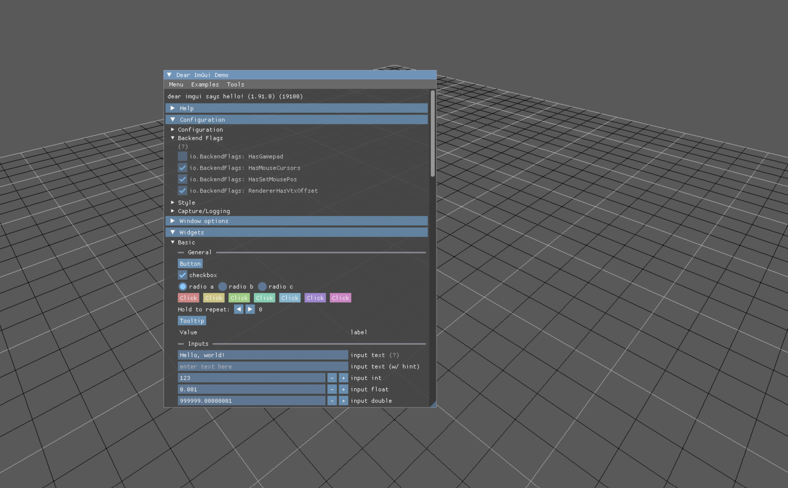
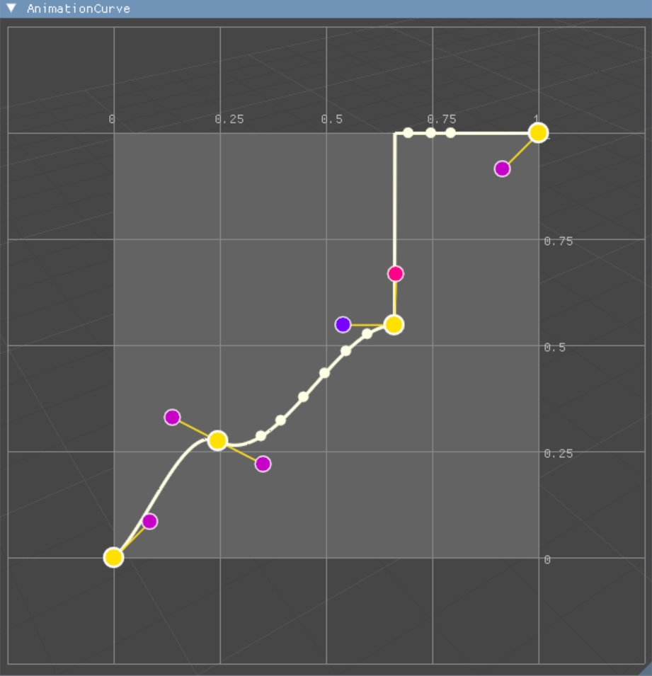

# DIYE

DIY engine (DIYE for short) is a highly opinionated toolkit for 3D-based applications and games.

It's not meant to be a general-purpose engine, but rather a collection of mid-level abstractions that can give you a head start on your project
without having to worry about the boilerplate code but still giving you the flexibility to customize it to your needs.

It's not a library so copy and paste the parts you need and modify them to your liking then throw away things you don't want.
You can even copy single file or function to your project if you like (link attribution is appreciated but not required).

## Roadmap

Plan for the next release:

- [ ] Vulkan Allocator
- [ ] RenderDoc integration
- [x] Slang
- [x] OSX compilation without errors

## Screenshots

### OBJ Loader and rotation gizmo



### Debug primitives renderer



### ImGui integration



### Animation Curve with Editor

Watch video [here](.github/docs/curve.mp4)



## Development

Make sure to go through the setup steps before starting development.

Consider installing everything to `C:\\sdk`.

Useful links:
- https://cmake.org/download/
- https://learn.microsoft.com/en-gb/vcpkg/get_started/get-started?pivots=shell-cmd
- https://vulkan-tutorial.com/Development_environment
- https://github.com/ninja-build/ninja/releases
- https://github.com/shader-slang/slang

Add to user env `PATH`:

- C:\Program Files\Microsoft Visual Studio\2022\Community\VC\Tools\MSVC\14.41.34120\bin\Hostx64\x64
- C:\Program Files (x86)\Windows Kits\10\bin\10.0.22621.0\x64
- C:\Program Files\Microsoft Visual Studio\2022\Community\Common7\IDE\CommonExtensions\Microsoft\CMake\Ninja
- C:\Program Files\Microsoft Visual Studio\2022\Community\Common7\IDE\CommonExtensions\Microsoft\CMake\CMake\bin

Set `CXX` to:
- C:\Program Files\Microsoft Visual Studio\2022\Community\VC\Tools\MSVC\14.41.34120\bin\Hostx64\x64\cl.exe

## Setup

Init CMake:

```
cmake --preset debug .
``` 

Copy assets to build directory and download modified viking model from https://vulkan-tutorial.com/Loading_models.

### Ubuntu

Install dependencies:

```bash
sudo apt install libxrandr-dev libtool autoconf automake pkg-config libwayland-dev
```

Then install vulkan SDK and configure vulkan sdk root.

You might need to use for Clang before setting up the project:

```
export CFLAGS="$CFLAGS -Wno-error=unterminated-string-initialization"
```

## Dependencies

Libraries:

- Vulkan
- ImGui
- ImGuizmo
- SDL2
- SDL2_image
- GLEW
- fmt
- GLM
- TinyOBJLoader
- imdd

Stack:
- C++17
- GLSL
- CMake
- vcpkg
- ninja (optional for shader compilation)

## Timeline

Releases:
- 2026.Q1: Use Slang as default shading language, fixed sync issues.
- 2025.Q1: Initial release with basic rendering, UI, camera, debug primitives renderer, input and OBJ loader
